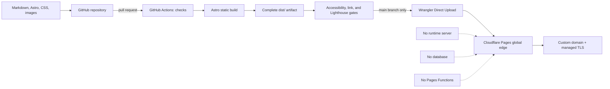

# Ahammed Nibras — Engineering Portfolio

> A proof-first portfolio that makes engineering judgment visible, ships as complete HTML, and runs from a global edge without an application server.

**Status:** architecture and content specification  
**Last researched:** 22 September 2026  
**Implementation:** intentionally not started; this document is the contract for the build

## The proposition

This portfolio is not a résumé enlarged into a website. It is a small, inspectable product that should answer four questions for a hiring manager, client, collaborator, search crawler, or software agent:

1. What problems can Ahammed solve?
2. What did he personally own?
3. What decisions did he make, and why?
4. What evidence shows that the work succeeded?

The site will render every meaningful word into HTML during CI. A visitor receives a useful document before JavaScript runs—and the core experience remains complete if JavaScript never runs. That makes the portfolio fast on modest devices, legible to crawlers and agents, easy to archive, and inexpensive to operate.

## Product principles

- **Evidence before adjectives.** Outcomes, constraints, artifacts, and decisions replace unsupported claims.
- **Useful in 30 seconds; rewarding in 10 minutes.** The home page supports scanning, while case studies supply depth.
- **HTML is the product.** JavaScript may enhance an interaction but may not carry primary content or navigation.
- **The repository is part of the portfolio.** Clear commits, accessible markup, automated checks, and documented trade-offs are evidence of craft.
- **Performance is a feature.** A portfolio cannot credibly claim engineering quality while making readers wait.
- **Original, not derivative.** PlanetScale informs the visual grammar; its identity, copy, assets, and page composition will not be copied.
- **Portable by construction.** The compiled `dist/` directory must work on any ordinary static host.

## Reference study: PlanetScale

The [PlanetScale home page](https://planetscale.com/) was visited and its rendered DOM inspected at a 1280 × 800 viewport on 22 September 2026. This is a point-in-time observation, not a claim about PlanetScale's private implementation.

### What the DOM revealed

| Signal | Observation | Portfolio adaptation |
| --- | --- | --- |
| Document shape | One `header`, one `main`, one `footer`, three `nav` landmarks; a single top-level content section | Keep the shell shallow and semantic; use `article` for each case study |
| Heading hierarchy | One `h1`, ten `h2`, four `h3` elements | One promise-led `h1`; predictable `h2` sections; no skipped levels |
| Typography | System monospace at 16 px / 24 px, including the main heading | Use monospace for labels, metadata, and technical artifacts; use a system sans face for longer prose |
| Layout | Approximately 1088 px of content inside a 1280 px viewport; repeated grids, rules, and bordered cells | A capped reading canvas, full-width rules, and responsive project grids |
| Palette | Near-black surface, warm white text, neutral gray scale, orange and blue accents | Build an original token set with one warm action color and one cool link color |
| Motion | Short, restrained transitions around 150 ms; little ornamental motion | CSS-only feedback, no scroll theatre, and full `prefers-reduced-motion` support |
| Proof strategy | Customer logos, quotations, benchmarks, architecture diagrams, and detailed capability lists | Lead with shipped work, measurable outcomes, decision records, and links to evidence |
| Delivery clues | One external stylesheet was observed; no external `script[src]` was present in the rendered document | Ship minimal CSS and no page-level JavaScript by default |

The most valuable lesson is not the dark theme or monospace type. It is the information rhythm: **claim → evidence → explanation → deeper technical proof**. That rhythm will drive the portfolio.

## Persuasion model

People scan web pages instead of reading every line, and hiring reviewers are not always specialists in the candidate's discipline. The information hierarchy therefore works from broadly legible value to progressively deeper evidence. This follows [Nielsen Norman Group's scanning research](https://www.nngroup.com/articles/f-shaped-pattern-reading-web-content/) and its finding that strong portfolios connect work to user and business outcomes in a thoughtfully written experience ([UX careers report, pp. 76–77](https://media.nngroup.com/media/reports/free/UserExperienceCareers_2nd_Edition.pdf)).

### The 30-second path

1. **Positioning:** name, role, location/time-zone availability, and one concrete statement of value.
2. **Proof strip:** three defensible numbers or facts, each linked to its source or case study.
3. **Selected work:** no more than three high-signal projects, ordered by relevance and impact.
4. **Operating range:** a compact map of problems solved—not a wall of technology logos.
5. **Trust:** current focus, open-source activity, writing, résumé, and a direct contact action.

### The case-study path

Every project page must use the same decision-oriented structure:

1. **Outcome** — the result in one sentence.
2. **Context** — the user, business, or system problem.
3. **Constraints** — time, scale, team, legacy, privacy, budget, or reliability boundaries.
4. **Ownership** — what Ahammed personally led, built, or decided; collaborators are credited.
5. **Decision record** — options considered, trade-offs, and the chosen approach.
6. **Execution** — architecture and selected implementation details.
7. **Evidence** — metrics, screenshots, code, demos, testimonials, or an honest qualitative result.
8. **Reflection** — what changed, what failed, and what would be done differently now.

If a metric cannot be published, the page must say why and use bounded evidence. It must never invent precision. Skill meters, generic adjectives, anonymous testimonials, and technology-logo clouds are excluded.

## Experience architecture

### Routes

| Route | Purpose | Required content |
| --- | --- | --- |
| `/` | Establish fit and route readers to proof | Hero, proof strip, selected work, principles, short bio, contact |
| `/work/` | Make all case studies comparable | Filter-free project index with role, outcome, year, and domain |
| `/work/[slug]/` | Demonstrate judgment in depth | The eight-part case-study structure above |
| `/about/` | Add human context and working preferences | Biography, values, timeline, current focus, contact |
| `/writing/` | Show clarity and sustained technical thinking | Article index; omit the route until real writing exists |
| `/resume/` | Give recruiters a fast printable artifact | Semantic HTML résumé plus a versioned PDF download |
| `/404.html` | Recover without a client router | Useful static error page with navigation home |

### Semantic DOM contract

The built pages must be useful when read as a document outline:

```text
body
├── a.skip-link
├── header
│   └── nav[aria-label="Primary"]
├── main#main-content
│   ├── section.hero
│   ├── section.proof
│   ├── section#selected-work
│   │   └── article.project-card × n
│   ├── section#principles
│   └── section#contact
└── footer
    └── nav[aria-label="Footer"]
```

Primary content may not be drawn into `canvas`, inserted with CSS `content`, or fetched only after load. Google explicitly recommends semantic HTML and text that is present in the DOM; it also notes that pre-rendering helps users, crawlers, and bots that do not execute JavaScript ([Google Search Central](https://developers.google.com/search/docs/crawling-indexing/javascript/javascript-seo-basics)).

## Visual direction

The visual system should feel technical, quiet, and exact without impersonating PlanetScale.

- **Tone:** editorial engineering notebook, not sci-fi dashboard.
- **Type:** system sans for readable prose; system monospace for navigation, labels, dates, code, and numeric proof. No font download on the critical path.
- **Color:** near-black and warm-white foundations with an amber action accent and cyan link accent. All pairings must meet WCAG AA; body text should target AAA where practical.
- **Composition:** 12-column desktop grid, strong horizontal rules, compact metadata, generous space around major arguments, and a prose measure near 68 characters.
- **Imagery:** optimized project screenshots and original SVG diagrams. Every informative image requires meaningful alternative text; decorative SVGs are hidden from assistive technology.
- **Motion:** 120–180 ms state transitions only. No mandatory parallax, smooth-scroll dependency, cursor replacement, or content-revealing animation.
- **Responsive behavior:** content order—not desktop geometry—defines the mobile layout. The smallest supported viewport is 320 CSS pixels.
- **Theme:** dark-first with a tested light theme; both use shared semantic tokens rather than hard-coded component colors.

## Technology decision

### Winner: Astro in static-output mode

Astro is the best-fit tool for this portfolio—not a universal winner for every website. The requirements weight complete build-time HTML, minimal browser JavaScript, typed content, image optimization, component reuse, and static-host portability above application-style state management.

[Astro's architecture](https://docs.astro.build/en/concepts/why-astro/) is server-first, emits zero client JavaScript by default, and permits isolated interactive components only where requested. Build-time content collections provide schema validation and caching for structured Markdown content, and local image transforms can run during a static build ([content collections](https://docs.astro.build/en/guides/content-collections/), [image service](https://docs.astro.build/en/reference/image-service-reference/)). Those properties map directly to this project's constraints.

### Evaluated solution classes

“Every possible tool” is an unbounded set, so the comparison covers every materially different architecture that could satisfy this project: hand-authored files, traditional static-site generators, component-first static generators, application frameworks with static export, and runtime rendering.

| Option | Built HTML | Default client cost | Content model | Component ergonomics | Operational fit | Decision |
| --- | ---: | ---: | ---: | ---: | ---: | --- |
| Hand-written HTML/CSS | Excellent | Excellent | Weak at multiple case studies | Weak | Excellent | Too much repetition and no content schema |
| Eleventy | Excellent | Excellent | Strong | Moderate | Excellent | Best lean alternative; [zero client JS by default](https://www.11ty.dev/) but less cohesive TypeScript/component/image tooling for this design |
| Hugo or Zola | Excellent | Excellent | Strong | Moderate | Excellent | Extremely fast builders; adds a second templating ecosystem without a benefit this small site needs |
| **Astro** | **Excellent** | **Excellent** | **Strong and typed** | **Strong** | **Excellent** | **Selected: strongest weighted fit** |
| SvelteKit or Qwik static export | Strong | Good | Moderate | Strong | Strong | Valuable for richer applications; unnecessary runtime and adapter surface here |
| Next.js or Gatsby static export | Strong | Moderate | Strong | Strong | Strong | React-centered runtime and dependency cost do not improve this content-first site |
| Runtime SSR / CMS | Variable | Variable | Strong | Strong | Weak | Reject: adds servers, cold paths, cost risk, and availability dependencies |

### Development toolchain

Local development and GitHub Actions use Node.js 24.21.0 LTS. Production remains runtime-free: Cloudflare Pages serves the static `dist/` artifact and does not execute Node.js.

Commands that load Astro configuration require `SITE_URL` to contain the canonical HTTPS origin. Builds fail when it is missing or includes credentials, a path, a query, or a fragment, preventing incorrect canonical URLs and sitemap entries from being published.

Node.js recommends supported LTS releases for production-oriented tooling; Node 24 is the current LTS line, while Node 26 remains Current until October 2026 ([Node.js release schedule](https://nodejs.org/en/about/previous-releases)).

| Manager | Strength | Weakness here | Decision |
| --- | --- | --- | --- |
| npm | Bundled with Node and has the lowest onboarding friction | Hoisted dependencies and less efficient shared storage | Good fallback |
| **pnpm** | Strict dependency visibility, content-addressed storage, fast CI caching, and controlled install scripts | Contributors may need to install it once | **Selected** |
| Yarn Modern | Strong constraints and zero-install support | Plug'n'Play adds editor and compatibility complexity unnecessary for one site | Reject |
| Bun | Very fast installer and runtime | Introduces a second runtime ecosystem without improving the final static output | Reject |

pnpm prevents undeclared dependency access and reuses packages through a content-addressed store ([pnpm motivation](https://pnpm.io/motivation)). Yarn documents that Plug'n'Play can require editor SDKs and package extensions ([Yarn install modes](https://yarnpkg.com/features/linkers)). Bun is capable, but installer speed for this small static build does not outweigh Node ecosystem compatibility.

### Selected stack

| Layer | Choice | Reason |
| --- | --- | --- |
| Rendering | Astro, `output: "static"` | Produces complete route-level HTML in CI |
| Language | Strict TypeScript | Makes components, metadata, and content transformations auditable |
| Content | Markdown in Astro content collections | Git history, portable text, schema-checked front matter |
| Styling | Modern vanilla CSS in scoped layers | No runtime; explicit tokens; fewer dependencies; original visual language |
| Client behavior | Native HTML first; small framework-free modules only when justified | Avoids hydration and protects no-JS operation |
| Images | `astro:assets`, AVIF/WebP plus an explicit fallback | Build-time sizing, formats, and layout-shift prevention |
| Development runtime | Node.js 24.21.0 LTS | Pins local tooling and GitHub Actions without adding a production runtime |
| Package manager | pnpm 12.5.1 with a committed lockfile and frozen installs | Enforces declared dependencies and reuses a content-addressed package store |
| Validation | Astro check, ESLint, Prettier, Playwright, axe, Lighthouse CI | Static correctness plus rendered-browser evidence |
| Source and CI | Public GitHub repository + GitHub Actions | The code and delivery history remain inspectable |
| Delivery | Cloudflare Pages Direct Upload | Deploys the prebuilt folder to a global static network |

React, Vue, Svelte, and other UI runtimes are prohibited in the initial build. An island may be added later only with a decision record showing that native HTML and a small DOM module cannot meet a real user need.

## System architecture



The same tested `dist/` artifact is deployed. Production does not rebuild source, call a database, or execute a function. That removes an entire class of runtime failures and makes rollback an artifact selection problem.

### Planned repository shape

```text
.
├── .editorconfig
├── .gitattributes
├── .github/
│   └── workflows/
│       ├── ci.yml
│       └── deploy.yml
├── .gitignore
├── .node-version
├── .npmrc
├── public/
│   ├── _headers
│   ├── _redirects
│   ├── favicon.svg
│   └── robots.txt
├── src/
│   ├── assets/
│   ├── components/
│   ├── content/
│   │   ├── projects/
│   │   └── writing/
│   ├── data/
│   │   └── profile.ts
│   ├── layouts/
│   ├── pages/
│   └── styles/
│       ├── tokens.css
│       ├── global.css
│       └── utilities.css
├── tests/
├── astro.config.mjs
├── package.json
├── pnpm-lock.yaml
├── pnpm-workspace.yaml
└── tsconfig.json
```

## Delivery architecture and cost

### Recommended path

1. A pull request runs deterministic checks and builds `dist/`.
2. A merge to `main` repeats the checks in a clean runner.
3. GitHub Actions invokes `wrangler pages deploy dist` with a least-privilege Cloudflare token stored as a GitHub secret.
4. Cloudflare places the files on its globally distributed network and serves them through the custom domain.
5. Hashed assets receive a one-year immutable cache policy; HTML revalidates so releases become visible quickly.

Cloudflare documents this exact prebuilt-asset CI flow for [Pages Direct Upload](https://developers.cloudflare.com/pages/how-to/use-direct-upload-with-continuous-integration/). Custom response and security headers live in `public/_headers`, which Cloudflare applies to static responses ([headers documentation](https://developers.cloudflare.com/pages/configuration/headers/)). Third-party Actions must be pinned to full commit SHAs because GitHub identifies that as the only immutable reference ([GitHub secure-use guidance](https://docs.github.com/en/actions/reference/security/secure-use)).

### Why Cloudflare Pages instead of S3

| Host model | Static CDN | Custom domain/TLS | Free-plan fit | Portability | Decision |
| --- | --- | --- | --- | --- | --- |
| **Cloudflare Pages** | Global edge | Included | Purely static requests are currently free and unlimited | High | **Selected** |
| GitHub Pages | Managed static hosting | Included | Good public-repository fallback | High | Recovery target, not primary delivery |
| Netlify / Vercel | Managed edge | Included | Suitable, but broader app platforms add no advantage here | High | Viable alternative |
| Amazon S3 + CloudFront | Object store + CDN | Available | AWS's current new-account free plan expires | High | Reject for a zero-bill objective |
| Self-hosted server | Origin dependent | Manual | Ongoing compute, patching, and availability burden | Moderate | Reject |

As of the research date, Cloudflare Pages' Free plan documents 500 builds per month, 20,000 files per site, a 25 MiB individual-file cap, up to 100 custom domains per project, and uploads to its global network; purely static requests are free and unlimited ([Pages limits](https://developers.cloudflare.com/pages/platform/limits/), [static routing](https://developers.cloudflare.com/pages/functions/routing/)). GitHub Actions is currently free on standard hosted runners for public repositories ([GitHub billing](https://docs.github.com/en/actions/concepts/billing-and-usage)). By contrast, AWS states that its new-account free plan ends after six months or when credits are exhausted, and S3 is usage-priced ([S3 pricing](https://aws.amazon.com/s3/pricing/)).

### The honest “free for life” statement

No external provider can be guaranteed free for life: pricing, limits, ownership, and terms can change. The defensible promise is:

> The architecture has no paid runtime dependency and is designed to remain at a zero hosting bill within the providers' published free-plan limits.

The domain registration and renewal are not free hosting and remain the owner's responsibility. If the custom domain lapses, the provider subdomain can still serve the site. If Cloudflare's terms change, `dist/` can move to GitHub Pages, another static host, an object store, or any conventional web server without an application rewrite.

R2 or another object store is unnecessary for the initial portfolio. If a future artifact exceeds Pages' 25 MiB per-file limit, it may be moved to R2 after a separate cost and privacy review; R2 currently includes a monthly free allowance but is a metered product ([R2 pricing](https://developers.cloudflare.com/r2/pricing/)).

## CI/CD contract

Every pull request must pass the following gates before merge:

1. Install exactly from `pnpm-lock.yaml` with `pnpm install --frozen-lockfile`.
2. Check Astro and TypeScript diagnostics.
3. Enforce formatting and lint rules.
4. Validate content schemas, unique slugs, dates, and required image alternatives.
5. Build the static site from a clean checkout.
6. Fail on broken internal links, missing canonical URLs, or duplicate page titles.
7. Run keyboard-navigation and axe checks against the built site in Playwright.
8. Run Lighthouse CI against representative home, index, case-study, and résumé pages.
9. Confirm that core page content exists in the raw built HTML and that no unexpected JavaScript bundle was emitted.

Deployment runs only after these gates pass on `main`. Pull requests from forks do not receive deployment secrets. Workflow permissions default to read-only, dependencies are updated deliberately, and external Actions are SHA-pinned.

## Quality budgets

These are release gates, not aspirations:

| Area | Budget |
| --- | --- |
| Initial JavaScript | 0 kB for content-only routes; ≤ 20 kB compressed on any enhanced route |
| First-party CSS | ≤ 40 kB compressed per route |
| Initial transferred page weight | ≤ 500 kB on the home page at launch |
| Lighthouse CI | ≥ 95 for Performance, Accessibility, Best Practices, and SEO on representative mobile runs |
| Core Web Vitals target | LCP ≤ 2.5 s, INP ≤ 200 ms, CLS ≤ 0.1 at the 75th percentile |
| Accessibility | WCAG 2.2 AA; full keyboard path; visible focus; 200% zoom without lost content |
| Browser baseline | Current and previous major versions of evergreen browsers; useful content without JS |

The Core Web Vitals thresholds are Google's published “good” values ([web.dev](https://web.dev/articles/vitals)). Lighthouse CI is a regression detector, not a substitute for field data; Google notes that Lighthouse scores can vary with environment ([Lighthouse scoring](https://developer.chrome.com/docs/lighthouse/performance/performance-scoring)). Field measurement should be considered only after meaningful traffic exists and only with a privacy review.

## Discoverability for people, crawlers, and agents

Each route must include:

- a unique title and plain-language meta description;
- one canonical URL;
- Open Graph and social-card metadata;
- crawlable `<a href>` navigation;
- generated `sitemap-index.xml` and a permissive `robots.txt` for production;
- JSON-LD using appropriate `Person`, `WebSite`, `ProfilePage`, `Article`, and `CreativeWork` types;
- explicit published/updated dates where truthful;
- stable project URLs and permanent redirects for any changed slug;
- meaningful headings, lists, tables, `time`, `figure`, and `figcaption` elements;
- a short machine-readable project summary in front matter that matches the visible copy.

Preview deployments must be `noindex`. Structured data supplements the visible HTML; it must not contain claims that a human reader cannot verify on the page.

## Security and privacy

- No application server, database, authentication, contact-form backend, or third-party script at launch.
- Contact links use email or a named professional profile; the site does not collect form data.
- The production policy includes a restrictive Content Security Policy, `X-Content-Type-Options`, `Referrer-Policy`, frame restrictions, and a minimal `Permissions-Policy`.
- External links that open a new browsing context use the appropriate `rel` protections.
- Secrets exist only in GitHub Actions, are scoped to Pages deployment, and never enter the built artifact.
- Analytics are off by default. Any future analytics addition requires a documented purpose, retention policy, data-flow review, and performance-budget allocation.
- Public artifacts are assumed permanent. Private client names, credentials, internal screenshots, and confidential metrics must never enter Git history.

## Content acceptance criteria

A project is ready to publish only when it has:

- a specific problem and named audience;
- the author's exact role and collaboration boundary;
- at least one meaningful constraint;
- at least one decision with an alternative and trade-off;
- evidence of the result or an explicit explanation of why evidence is unavailable;
- a current screenshot, diagram, repository, demo, or other inspectable artifact where disclosure permits;
- descriptive alt text and verified links;
- permission to publish every name, logo, quotation, and metric it contains.

The home page launches with two strong case studies rather than six shallow ones. Unfinished sections stay out of navigation instead of shipping as “coming soon.”

## Definition of done

Version 1 is complete when:

- the route and semantic DOM contracts above are implemented;
- at least two publishable case studies meet the content acceptance criteria;
- the site works at 320 px, with keyboard only, at 200% zoom, and with JavaScript disabled;
- CI enforces the quality budgets and accessibility checks;
- production deploys the tested `dist/` artifact from `main` to Cloudflare Pages;
- the custom domain redirects to one canonical HTTPS hostname;
- caching, security headers, `404.html`, sitemap, robots rules, social cards, and structured data are verified in production;
- the README's provider limits and architecture links have been rechecked at implementation time;
- no PlanetScale copy, proprietary asset, logo, or distinctive composition has been reproduced.

## Decision summary

| Question | Decision |
| --- | --- |
| What are we building? | A proof-led engineering portfolio for fast human and machine evaluation |
| Where is rendering performed? | In GitHub Actions during the Astro static build |
| What reaches the browser? | Complete semantic HTML, CSS, optimized media, and only justified enhancement scripts |
| Why not React? | This is a content document, not a stateful application; hydration adds cost without user value |
| Where does the build live? | Cloudflare Pages' globally distributed static network |
| What runs in production? | No server, function, or database |
| Can it be free forever? | No provider can promise that; the design targets a zero bill under current published limits |
| Can we leave the provider? | Yes; `dist/` is a portable static artifact |
| What is borrowed from PlanetScale? | Restraint, grid rhythm, technical typography, and proof-first sequencing—not brand expression or assets |

## Research record

Primary and direct sources used for this architecture:

- [PlanetScale home page](https://planetscale.com/) — live visual and rendered-DOM inspection.
- [Astro: Why Astro?](https://docs.astro.build/en/concepts/why-astro/) — server-first model, islands, and zero-JavaScript default.
- [Eleventy](https://www.11ty.dev/) — static-generator alternative and zero-client-JavaScript baseline.
- [Google Search Central: JavaScript SEO basics](https://developers.google.com/search/docs/crawling-indexing/javascript/javascript-seo-basics) — rendering, link discovery, metadata, and pre-rendering guidance.
- [Nielsen Norman Group: F-shaped scanning](https://www.nngroup.com/articles/f-shaped-pattern-reading-web-content/) and [UX careers research](https://media.nngroup.com/media/reports/free/UserExperienceCareers_2nd_Edition.pdf) — scan behavior and portfolio evidence.
- [Cloudflare Pages limits](https://developers.cloudflare.com/pages/platform/limits/), [Direct Upload CI](https://developers.cloudflare.com/pages/how-to/use-direct-upload-with-continuous-integration/), and [custom domains](https://developers.cloudflare.com/pages/configuration/custom-domains/) — delivery design and current free-plan boundaries.
- [GitHub Actions billing](https://docs.github.com/en/actions/concepts/billing-and-usage) and [secure use](https://docs.github.com/en/actions/reference/security/secure-use) — public-repository CI economics and workflow hardening.
- [AWS S3 pricing](https://aws.amazon.com/s3/pricing/) — rejection of a time-limited free-plan dependency.
- [web.dev: Web Vitals](https://web.dev/articles/vitals) and [Chrome Lighthouse](https://developer.chrome.com/docs/lighthouse/overview) — experience targets and automated regression testing.

---

This README is deliberately specific. An implementation that changes a selected technology, introduces client rendering for primary content, adds a runtime service, weakens a release gate, or creates a recurring cost must update this document with the reason and trade-off in the same change.
